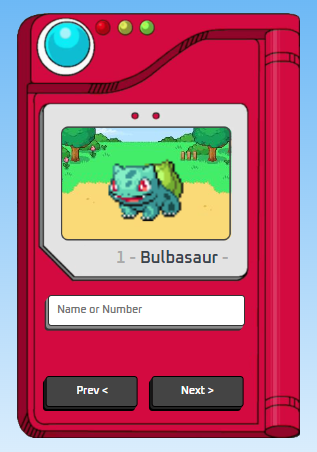

# Tutorial criação de Pokédex (HTML/CSS/JS) - svelte twist

## O projeto foi realizado seguindo um [tutorial no youtube](https://youtu.be/SjtdH3dWLa8)

### Nome do vídeo:
> Como criar uma Pokedex com HTML, CSS e JavaScript | Projeto Completo

Todos os créditos para o canal - **Manual do Dev**

### Addendum
- criado em svelte para aprender coisas novas
- adicionado axios em classe separada para separação de responsabilidades
- 